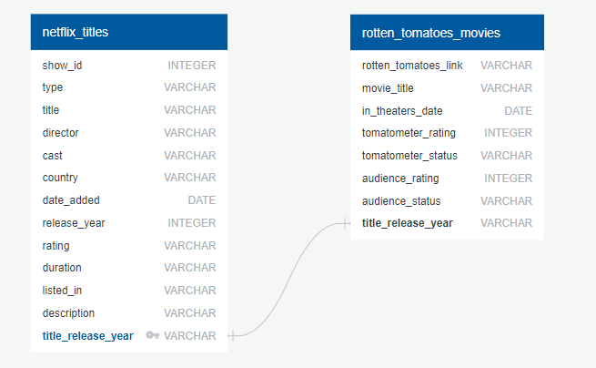

# ETL Project Submission
by Samir Sundar, Jack Oremus, Jade Guo, Jennie Chang

## Project Overview

  

  

Bring Rotten Tomatoes ratings to Netflix movies
- Join Netflix data and Rotten Tomatoes data by movie name & release year

## EXTRACT
Data Sources found on Kaggle:
- Netflix Movies and TV Shows by Shivam Bansal
- Rotten Tomatoes - Movies and Critics datasets by Stefano Leone
  
Both datasets were in CSV format

## TRANSFORM - What data cleaning/transformation was required?
- Cleaning
  - Both datasets: drop all null values
  - Netflix: kept all columns as is as Netflix data serves as parent dataset
  - Rotten Tomatoes: exclude all columns except for rotten_tomatoes_link, movie_title, in_theaters_date, tomatometer_status, tomatometer_rating, audience_rating
  
- Joining
  - Join datasets based on unique key concatenated by movie title and release year
  

  

  
- Filtering
  - Filtered both datasets for movies specifically (excluded TV shows)

## LOAD
 - Load the final table to Postgres SQL as a relational database would be a better fit.
 
